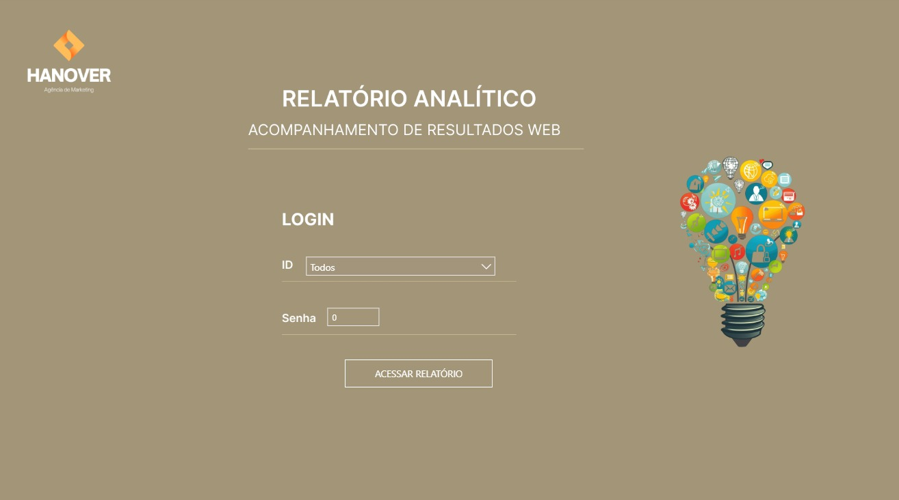
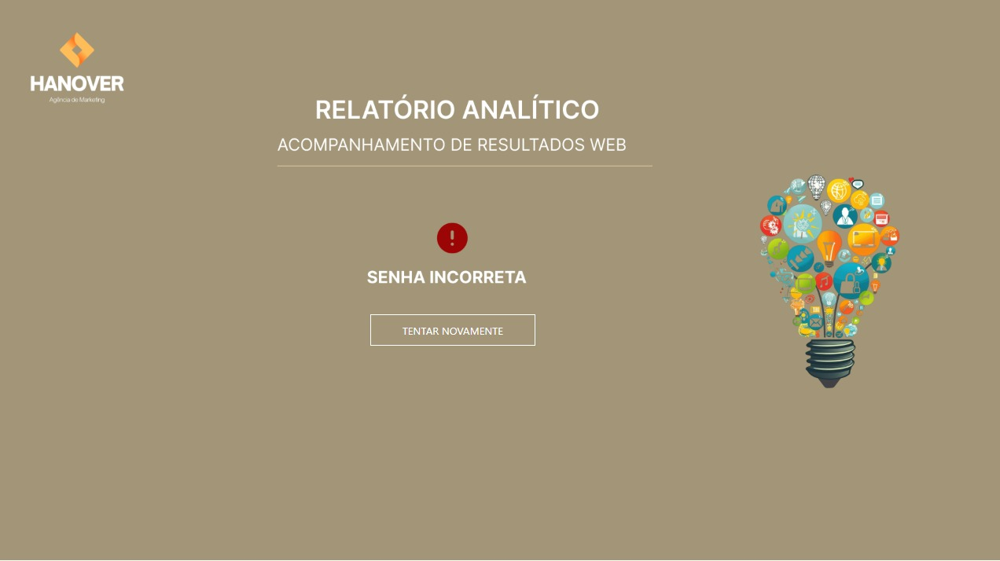
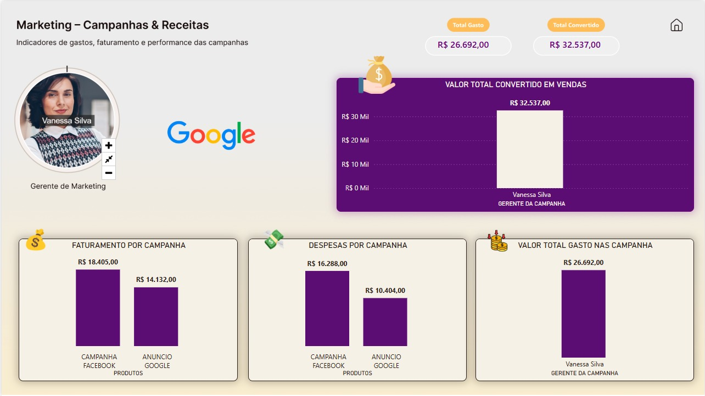
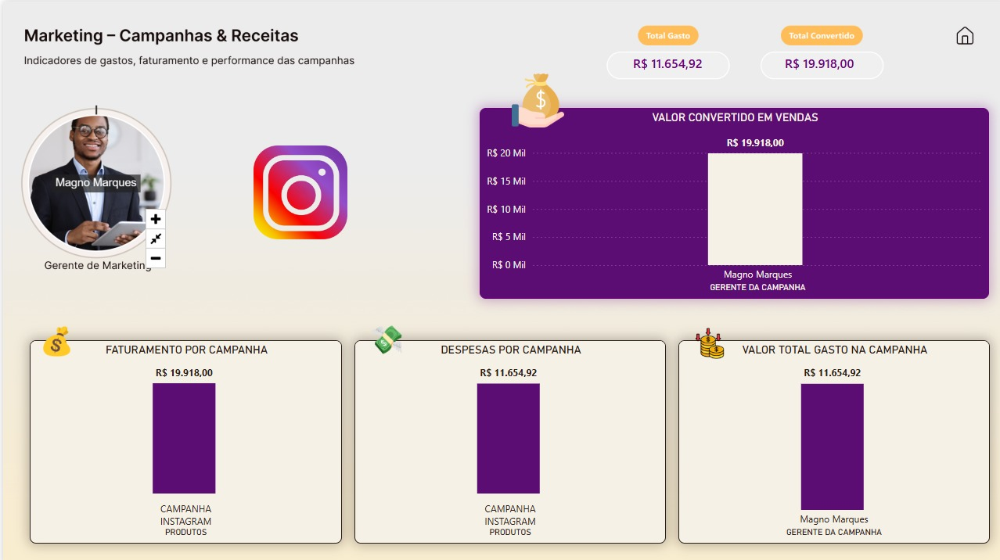
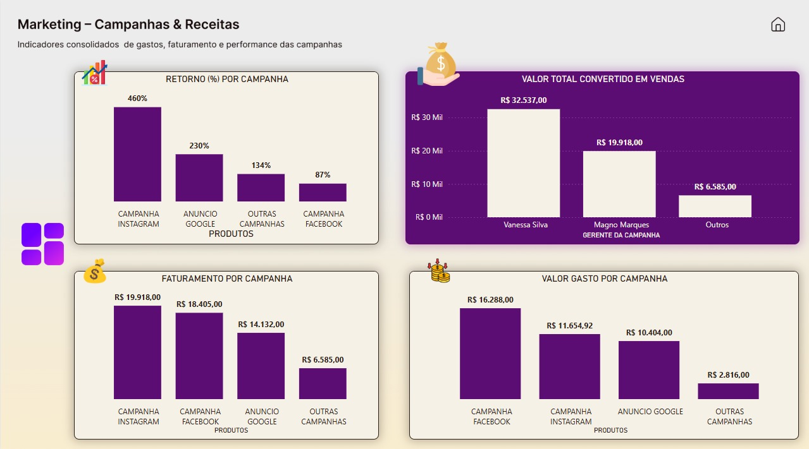

# 📊 Marketing – Campanhas & Receitas (Power BI)

Relatório analítico desenvolvido em **Power BI** com foco na análise de desempenho de campanhas de marketing, avaliando **gastos, faturamento, conversão e retorno sobre investimento (ROI)**.

---

## 🎯 Objetivo do Projeto
Analisar a eficiência das campanhas de marketing digital, permitindo:
- Comparar investimento vs faturamento
- Avaliar ROI por campanha
- Identificar gestores e canais com melhor desempenho
- Apoiar decisões estratégicas baseadas em dados

---

## 🔐 Controle de Acesso por Token (Senha)

Este relatório foi desenvolvido com uma **camada de controle de acesso**, simulando um **login por token (senha)** diretamente no Power BI.

### 🧠 Como funciona
- O acesso ao relatório é condicionado à inserção de um **token válido**
- O token é informado pelo usuário por meio de um **parâmetro**
- Uma **medida DAX** valida o token informado
- Caso o token seja inválido:
  - O usuário é direcionado para uma **tela de erro**
- Caso o token seja válido:
  - O relatório é liberado para navegação completa

Essa abordagem simula um **controle de acesso lógico**, comum em dashboards corporativos e apresentações para clientes.

## 🧩 Indicadores Analisados
- 💰 Valor gasto por campanha
- 📈 Faturamento por campanha
- 🔁 Retorno (%) sobre investimento
- 🧑‍💼 Conversão por gerente de campanha
- 📊 Total convertido em vendas

---

## 🖥️ Telas do Relatório

### 🔐 Tela de Login

### ❌ Tela de Erro

### 🔎 Campanha Google

### 📸 Campanha Instagram

### 📊 Visão Geral – Campanhas

---

## 🛠️ Ferramentas Utilizadas
- Power BI Desktop
- Modelagem de dados
- Medidas DAX
- Parâmetros e controle de navegação
- Visualização orientada a negócio
- Figma
> 🎨 O layout visual e o background do relatório foram desenvolvidos no Figma, com foco em identidade visual, usabilidade e melhor experiência do usuário.

---

## 📂 Arquivos do Projeto
- 📊 Relatório Power BI: `pbix/Marketing.pbix`
- 🖼️ Imagens: `imagens/`

---

## 🚀 Como Abrir o Projeto
Baixe o arquivo `Marketing.pbix` deste repositório e abra-o no Power BI Desktop.

---

## 📌 Observações
Projeto desenvolvido para fins de **aprendizado e portfólio em análise de dados**.
